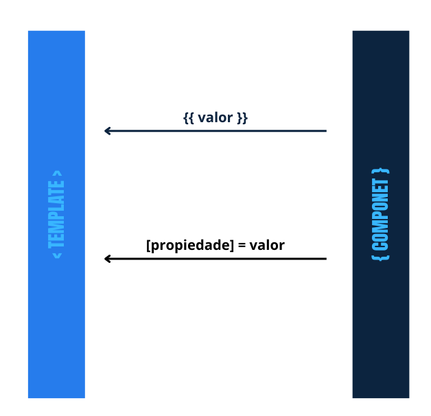
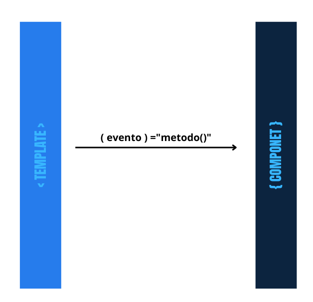

# Angular 14 

## 01 - Conhecendo o Angular

### Instalar e utilizar o Angular CLI

Para instalar o Angular CLI, abra seu terminal e utilize o seguinte comando:

`npm install -g @angular/cli@14.0.0`

### Criar uma aplicação Angular

Após instalarmos a ferramenta vamos usá-la para criar o projeto [memoteca, clique aqui e acesse o figma do projeto](https://www.figma.com/file/YTSUBbe7Zgwx3L567TAzTc/Memoteca---Angular%3A-Come%C3%A7ando-com-o-Framework?node-id=148%3A26), em seguida vá até o diretório que deseja construir sua aplicação e execute o comando a seguir:

`ng new memoteca`


[GitHub - Memoteca](https://github.com/alura-cursos/2438-angular-memoteca)

### Generate Component

Abra o terminal, e digite o comando ng `generate` e o caminho `componentes` juntamente com o nome do componente, que será "cabecalho":

`ng generate component componentes/cabecalho`

Será gerado os seguintes artefatos:

- cabecalho.component.css
- cabecalho.component.html
- cabecalho.component.spec.ts
- cabecalho.component.ts

Obs.: Você pode digitar a versão curta do comando: `ng g c componentes/cabecalho`

## 02 - Entendendo o fluxo de dados

### Property Binding
Passa valores de uma propriedade do component `pensamento.ts` para atributos de tag dentro do template `pensamento.html` com o uso de property binding;

` <input type="text" id="autoria" [value]="pensamento.autoria">`


Mostra valores de propriedades do component no template por meio da interpolação

`<p class="conteudo">{{ pensamento.conteudo }}</p>`



###  Event Binding
Escuta eventos do template e fazer a chamada de métodos no component com o event binding;

`<button (click)="criarPensamento()" class="botao">Salvar</button>`



### Two-way Data Binding
Usar a diretiva `ngModel` que pertence ao `FormsModule` para a comunicação bidirecional entre component e template.

Para isso, acessaremos no arquivo `app.module.ts`. Na seção imports, digitaremos uma vírgula após o último item e importaremos o `FormsModule`. Após o comando, o Auto Import fará a importação automática.

`imports: [BrowserModule,AppRoutingModule,FormsModule]`

No template substituir o atributo `[value]` pela diretiva `[(ngModel)]`, envolvendo-a em parênteses e colchetes por fora.

```
<input type="textarea" 
    class="input" 
    id="pensamento" 
    name="pensamento" 
    placeholder="Digite o pensamento" 
  [(ngModel)]="pensamento.conteudo">
```


## 03 - Navegação com roteamento

### Utilizar o RouterModule;

O RouterModule é um módulo do Angular que fornece a funcionalidade de roteamento na aplicação. Ele é responsável por gerenciar a navegação entre as diferentes telas ou componentes da aplicação.

### Utilizar a diretiva `<router-outlet>`;
Com o `router-outlet`, informamos ao Angular que queremos que os componentes sejam carregados dinamicamente atravez de roteamento.
No arquivo app.componets.html
```
<app-cabecalho></app-cabecalho>
<main>
    <router-outlet></router-outlet>
</main>
<app-rodape></app-rodape>
```

### Criar e configurar rotas;

no arquivo 'app-routing.module.ts' modificaremos o trecho `const routes: Routes = [];`

adicionando as rotas dos componetes criados dessa forma:
```
const routes: Routes = [
    {
        path: 'criarPensamento',
        component: CriarPensamentoComponent
    },
    {
        path: 'listarPensamento',
        component: ListarPensamentoComponent
    }
    
];
```
Com essa configurção ao acessar http://localhost:4200/criarPensamento/ o elemento será carregado na página .


Devemos criar também um path para a página inicial, com uma string vazia, que realizará um redirecionamento para o nosso mural de pensamentos.
```
{
    path: '',
    redirectTo: 'listarPensamento'
    pathMatch: 'full'
}
```
Assim, toda vez que acessarem a url raiz: http://localhost:4200/ será redirecionado pra rota configurada em `redirectTo`

### Navegar por meio da propriedade routerLink.

```
    <button 
      routerLink="/criarPensamento" 
    >Adicionar pensamento</button>

```

## 04 - Diretivas
As diretivas no Angular são instruções especiais que você pode adicionar aos elementos do seu template HTML para alterar o comportamento desses elementos. Elas permitem que você adicione lógica e funcionalidade aos seus componentes de uma maneira declarativa.

### Tipos diferentes de diretivas
Existem três tipos principais de diretivas no Angular:

1. Diretivas de Atributo: Modificam o comportamento ou a aparência de um elemento, componente ou outra diretiva.
1. Diretivas Estruturais: Alteram a estrutura do DOM, adicionando, removendo ou manipulando elementos.
1. Diretivas de Componente: São uma forma especial de diretiva que também possui um template.


### Diretivas estruturais, incluindo e excluindo elementos com ngFor e ngIf

#### ngFor

Antes de utilizá-la, acessaremos o arquivo `listar-pensamento.component.ts`, dentro da seção `export` criaremos o atributo listaPensamentos e inicializá-lo com um arranjo vazio.

`listaPensamentos = [];`

Acessaremos `listar-pensamento.html` e isolaremos o seletor `app-pensamento` em mais uma camada de div que vamos criar.

Nesta nova div interna, utilizaremos o ngFor. Esta diretiva é do tipo estrutural, pois consegue modificar os elementos no HTML. A sua sintaxe é `*ngFor=""`.

Essa diretiva receberá a expressão `"let pensamento of listaPensamentos"`, onde let criará uma variável local e `listaPensamentos` o atributo que criamos na classe.
```
    <div class="mural">
        <div *ngFor="let pensamento of listaPensamentos">
            <app-pensamento [pensamento]="pensamento"></app-pensamento>
        </div>
    </div>
```

No arquivo `listar-pensamento.html`, a comunicação entre componentes ocorre da seguinte maneira: o `listar-pensamento` atua como componente "pai" enquanto o `app-pensamento` seria um componente "filho".

Para passarmos as informações do componente "pai" `listar-pensamento` para o componente "filho" pensamento, acessaremos o arquivo pensamento.component.ts na seção export e vamos inserir o decorador `@Input()` ao lado de pensamento. Ao dar "Enter", será feita a importação automática deste arquivo.

`@Input() pensamento = {` 

#### ngIf

O `*ngIf` é uma diretiva estrutural do Angular que permite mostrar ou ocultar elementos do HTML com base em uma expressão booleana. Ela é muito útil para controlar a renderização de elementos com base em determinadas condições.

No exemplo aseguir, acessaremos o arquivo `listar-pensamento.component.html` e utilizaremos a diretiva `ngIf` diretamente na nossa div com a classe "mural", pois só queremos que essa div apareça se houverem pensamentos na propiedade `listaPensamentos` em `listar-pensamento.component.ts`.

```
<div class="mural" *ngIf="listaPensamentos.length > 0, else semPensamentos">
    <div *ngFor="let pensamento of listaPensamentos">
    <app-pensamento [pensamento]="pensamento"></app-pensamento>
    </div>
</div>
```

Caso a condição acima não ocorra `else` a diretiva renderiza o elemento `ng-template`com o nome `#semPensamentos.`
```
<ng-template #semPensamentos>
    <div class="ff-inter sem-pensamentos">
        <p>Ainda não há pensamentos cadastrados!</p>
  </div>
</ng-template>
```
Obs. o elemento `ng-template` não é renderizado por padrão, para isso é necessário que se indique, com o `else` nesse exemplo.


### Utilizar expressões para estilizar elementos com ngClass

No Angular isso é possível, através da configuração de estilos condicionais usando a diretiva `ngClass`. 

Para unificar os estilos dos cartões, acessaremos o componente `pensamento.component` que representa o cartão.

Se a gente abrir o arquivo CSS, veremos que existem duas configurações de largura:

```
.pensamento-g {
    width:556px;
}

.pensamento-p {
    width:262px;
}
```
Acessaremos o arquivo `pensamento.component.ts` e criaremos o método `larguraPensamento()` que retornará uma string. Dentro do método, criaremos uma condição para que os cartões sejam padronizados em dois tamanhos.
```
  larguraPensamento(): string {
    if(this.pensamento.conteudo.length >= 256) {
      return 'pensamento-g'
    }
    return 'pensamento-p'
  }
```
No arquivo `pensamento.component.html` na div de classe `pensamento`. Utilizaremos o `ngClass` em seu lugar, que receberá a expressão larguraPensamento criada no arquivo TS.
```
<div class="pensamento {{ pensamento.modelo }} ff-roboto-mono" [ngClass]="larguraPensamento()">
```
## 05 - 0Cumunicação com o Backend


### Utilizar o JSON-Server simulando uma API REST;

[Json-Server](backend/README.md)

### Criar uma interface para definir tipos personalizados;

A interface serve para definir a estrutura e o formato dos objetos que serão utilizados na aplicação Angular. Ela atua como um "contrato" entre o front-end e o back-end, garantindo que os dados sejam transmitidos e manipulados corretamente.

Criaremos uma interface diretamente no explorador à esquerda. Dentro da pasta pensamentos, damos um clique com o botão direito e criamos um novo arquivo chamado pensamento.ts. 

Dentro de `pensamento.ts`, criaremos uma interface de nome `Pensamento`, com inicial maiúscula. Nesta interface, colocaremos todos os atributos e os respectivos formatos esperados. Também incluiremos a classe export, para tornar essa interface acessível à outras classes.
```
export interface Pensamento {
    id: number
    conteudo: string
    autoria: string
    modelo: string
}
```

Como a interface que inserimos ajuda dentro da aplicação? Se tivéssemos incluído um atributo com o formato errado ou se esquecêssemos de informar algum atributo, o VS Code sinalizaria o erro.

Acessaremos três arquivos typescript e dentro deles vamos inserir a variável Pensamento, que deve receber a tipagem de Pensamento. Após o "Enter", a aplicação fará o import automático dessa variável.

- A primeira inclusão será feita no arquivo `pensamento.component.ts`.
```
@Input() pensamento: Pensamento = {
    id: 0, // colocamos o valor 0 pois os dados reais do `id` virão do componente "pai".
    conteudo: 'I love Angular',
    autoria: 'Nay',
    modelo: 'modelo3'
}
```
- A segunda inclusão será feita no arquivo `criar-pensamento.component.ts`.
```
pensamento: Pensamento = {
    id: 1,
    conteudo: 'Aprendendo Angular'
    autoria: 'Dev',
    modelo: 'modelo1'
}
```
- A terceira inclusão será feita no arquivo `listar-pensamento.component.ts`.
`    listaPensamentos: Pensamento[] = [];
`


#### Entender a importância do Service e o novo decorator @Injectable();

O Service no Angular é uma classe TypeScript que contém a lógica de negócios e a comunicação com o servidor. Algumas características importantes sobre os Services:

- São criados através do comando `ng g s` no terminal do VS Code.
São marcados com o decorador @Injectable, que permite a injeção de dependências.
- Possuem o metadado `providedIn` com o valor `root`, indicando que podem ser utilizados em toda a aplicação.
- Têm um construtor onde podem ser injetadas outras dependências.
Podem conter métodos de `CRUD (Create, Read, Update, Delete)` para interagir com o backend.
- A injeção de dependências é um conceito importante no Angular, pois permite que os Services sejam facilmente reutilizados em diferentes componentes da aplicação. Isso ajuda a manter o código organizado e facilita a manutenção.

```
import { Injectable } from '@angular/core';

@Injectable({
    providedIn: 'root'
})
export class PensamentoService {

    constructor() { }
}
```

### Injetar dependências.

A injeção de dependências é um conceito importante no Angular, pois permite que os Services sejam facilmente reutilizados em diferentes componentes da aplicação. Isso ajuda a manter o código organizado e facilita a manutenção.

No arquivo `pensamento.service.ts`, vamos adicionar o `HttpClient` para implementar os métodos do "CRUD". A classe PensamentoService depende dessa funcionalidade.

`import { HttpClient } from '@angular/common/http';`

Queremos que a instância de `HttpClient` seja injetada automaticamente no PensamentoService sem precisar ser instanciada manualmente. Para isso, no construtor da classe `PensamentoService`, incluiremos um parâmetro chamado http com o modificador de acesso private e o tipo de dependência `HttpClient`. O modificador private permite que esse parâmetro seja automaticamente declarado como um atributo da classe.
```
export class PensamentoService {
    constructor(http: HttpClient) { }
}
```

## 05 - Requisições HTTP

As requisições HTTP são a forma como os aplicativos web se comunicam com o servidor. Elas são a base da comunicação na web, permitindo que os clientes (como um navegador web) enviem solicitações para o servidor e recebam respostas.
Métodos HTTP: GET, POST, PUT, DELETE, etc. Esses métodos definem a ação que o cliente deseja realizar no servidor.

### Utilizar métodos de requisição HTTP com serviço HttpClient;

Dentro do VS Code acessaremos o arquivo `pensamento.service.ts` e utilizaremos os métodos `HTTP` já injetados na classe para construir o `CRUD`. Começaremos pelo método de listagem, criando o atributo API.

Voltando ao interior da classe, dentro do exportvamos inserir o comando abaixo:

`private readonly API = 'http://localhost:3000/pensamentos'`


Ainda dentro do export, abaixo do constructor acrescentaremos o método listar. Dentro do método vamos inserir o comando return com o método get. Adicionaremos também a tipagem Pensamento[] que possui um arranjo de pensamentos.

    listar() {
        return this.http.get<Pensamento[]>(this.API)
    }

Para poder utilizar o HttpClient é preciso importar o seu módulo. Acessaremos o arquivo `app.module.ts` e na seção imports, abaixo de outros módulos já configurados, adicionaremos uma vírgula (,) e em seguida o módulo `HttpClientModule`.

```
    imports: [
        BrowserModule,
        AppRoutingModule,
        FormsModule,
        HttpClientModule
  ],
```
A própria aplicação inserirá automaticamente o comando de importação abaixo. Caso contrário, podemos inseri-lo manualmente.

`import { HttpClientModule} from '@angular/common/http';`

Com este processo feito, temos um método dentro do service que solicitará ao `HTTP` a lista de pensamentos que se encontra na API e que vai recebê-la na forma de um arranjo de pensamentos.

Vamos acessar o arquivo `listar-pensamento.component.ts` e configurá-lo para consumir o serviço. Liberaremos o acesso aos métodos declarados no service injetando-o dentro do construtor na seção export.

```
export class ListarPensamentoComponent implements OnInit {

    listaPensamentos: Pensamento[] = [];

    constructor(private service: PensamentoService) { }
```

Vamos inserir o método `listar()` que configuramos anteriormente dentro da seção `ngOnInit()` que se encontra abaixo do export. Essa seção faz parte da configuração do ciclo de vida do componente, portanto, nós vamos inserir dentro dela qualquer comando que queremos executar junto ao carregamento do componente.
```
ngOnInit(): void {
    this.service.listar()
}

```

### Utilizar o Observable no retorno dos métodos HTTP;

O Observable funciona de forma similar ao promise do Javascript, mas com a vantagem de possuir uma transferência de dados contínua. Ou seja, o Observable é capaz de emitir dados várias vezes durante a sua existência. Este comando faz parte da biblioteca RXJS, que é utilizada de forma camuflada pelo Angular e já vem instalada na aplicação.

Descobriremos o funcionamento do Observable para listar os pensamentos na tela do nosso mural. Primeiro, vamos acessar o arquivo pensamento.service.ts e inserir o Observable de Pensamento no método `listar()` do serviço `pensamento.service.ts`.
```
    import { Observable } from 'rxjs';
    // Trecho de código omitido

    listar(): Observable<Pensamento[]> {
        // Trecho de código omitido
    }
```
Em seguida vamos inserir a função do tipo arrow function para permitir que a lista do serviço receba a lista do Observable no componete `listar-pensamento.component.ts`.
```
    ngOnInit(): void {
        this.service.listar().subscribe((listaPensamentos) => {
            this.listapensamentos = listapensamentos
        });
    }
```
#### Criar Pensamento
Acessaremos novamente o VS Code e configuraremos o cadastro. Dentro do arquivo `pensamento.service.ts`, abaixo do método de listagem, digitaremos o método `criar()` e dentro dele vamos inserir a variável pensamento do tipo Pensamento, que também retornará um Observable de Pensamento, mas dessa vez o retorno não será um arranjo.

Dentro de criar(), vamos inserir um return com o método post, a URL da API e também o pensamento que iremos cadastrar.
```
    criar(pensamento: Pensamento): Observable<Pensamento> {
        return this.http.post<Pensamento>(this.API, pensamento)
    }
```

Acessaremos o arquivo `criar-pensamento.component.ts` para consumir o serviço. Dentro do constructor, injetaremos o serviço private service do tipo PensamentoService, que será importado automaticamente no componente. Em seguida, iremos até o método `criarPensamento()`, apagaremos o alert que criamos anteriormente e em seu lugar adicionaremos o serviço.
```
    criarPensamento() {
        this.service.criar(this.pensamento).subscribe()
    }
```
Acessaremos a classe pensamento e apagaremos os conteúdos de `conteudo`, `autoria` e `modelo`, já que a partir de agora eles serão gerados pelo método criar(). Apagaremos também a variável `id` por completo, o que gerará um erro que vamos corrigir em outro arquivo.
```
    pensamento: Pensamento = {
        conteudo: '',
        autoria: '',
        modelo: ''
    }
```
Para corrigir o erro de id, acessaremos o arquivo da interface `pensamento.ts` e alteraremos a variável `id` inserindo um ponto de interrogação (?). Assim, o id se torna uma variável opcional.
```
export interface Pensamento {
    id?: number
    conteudo: string
    autoria: string
    modelo: string
}
```

Nós queremos que, ao salvar ou cancelar, haja um redirecionamento para a página do mural. Para isso, vamos utilizar uma funcionalidade de rotas chamada `router`. Dentro do constructor de `criar-pensamento.component.ts`, vamos inserir esse serviço.
```
    constructor(
        private service: PensamentoService,
        private router: Router
    ) { }
```
Dentro de criarPensamento vamos inserir uma arrow function (função seta) (=>) que retorna o router com o método navigate. Este por sua vez receberá o caminho para onde queremos que a página seja redirecionada. Note que a rota fornecida estará dentro de um Event Binding.
```
    criarPensamento() {
        this.service.criar(this.pensamento).subscribe(() => {
            this.router.navigate(['/listarPensamento'])
        )}
```
Faremos o mesmo processo para o botão de cancelar. Primeiro, acessaremos o arquivo `criar-pensamento.component.html` e deletaremos o `routerLink` que configuramos anteriormente dentro do button, para centralizar os redirecionamentos no arquivo TS. Abaixo podemos ver como ficou o código após a retirada desse comando.
```
    <div class="acoes">
        //Trecho de código omitido
        <button (click)="cancelar()" class="botao">Cancelar</button>
    </div>
```
Voltando ao arquivo `criar-pensamento.component.ts`, vamos inserir a mesma função de `criarPensamento()` dentro de `cancelar()`
```
    cancelar() {
        this.router.navigate(['/listarPensamento'])
    }
```
### Excluir Pensamento
Agora que concluímos o cadastro e a listagem de pensamentos, continuaremos com as outras funcionalidades do "CRUD".

Pare o terminal do front-end. Para fins de didática, criaremos um novo componente que será responsável pela exclusão dos pensamentos, assim manteremos cada função do CRUD separada em um componente diferente.

`ng g c componentes/pensamentos/excluir-pensamento`

Substitua ó código gerado em `excluir-pesamento.component.html` por esse:
```
<section class="container excluir-pensamentos ff-inter">
    <div class="modal">
        <p>O pensamento será deletado. <br/> Confirma a exclusão?</p>
        <div class="acoes">
            <button class="botao botao-excluir" (click)="excluirPensamento()">Excluir</button>
            <button class="botao botao-cancelar" (click)="cancelar()">Cancelar</button>
        </div>
    </div>
    <div class="overlay"></div>//deixa o resto da págna escura
</section>
```
Acessaremos `pensamento.service.ts` e criaremos a função `excluir`, que precisará do endereço e do `id` do pensamento a ser excluído. Vamos inserir o `id` do pensamento e um `Observable` de `Pensamento`. Dentro da função, criaremos uma `const` (ou constante) com o nome `url`. Em seguida configuraremos o retorno através do método delete junto à `URL`. Este método fará a exclusão do pensamento.
```
    excluir(id: number): Observable<Pensamento> {
        const url = `${this.API}/${id}`
        return this.http.delete<Pensamento>(url)
    }
```
Abaixo de `excluir()`, criaremos outro método para buscar um pensamento pelo `id`. Vamos passar o parâmetro `id` que retornará um `observable` de Pensamento. Criaremos também uma  `const` idêntica à do método excluir, porém utilizaremos o método `get` como retorno, pois queremos somente buscar um 
pensamento.
```
    buscarPorId(id: number): Observable<Pensamento> {
        const url = `${this.API}/${id}`
        return this.http.get<Pensamento>(url)
    }
```

Acessaremos o arquivo `excluir-pensamento.component.ts`, criaremos o parâmetro `pensamento` do tipo `Pensamento` e em seguida vamos inserir algumas variáveis vazias. Em seguida faremos o import da classe `Pensamento`.
```
    pensamento: Pensamento = {
        id: 0,
        conteudo: '',
        autoria: '',
        modelo: ''
    }
```
Dentro do constructor injetaremos os serviços que vamos utilizar: `PensamentoService`, `router`. Vamos inserir também o serviço `route` do tipo `ActivatedRoute`, que fornecerá informações sobre as rotas dos cartões de pensamento. Aliado a outros métodos como `snapshot` e `paramMap`, conseguiremos informações sobre os cartões em momentos específicos.

```
 import { ActivatedRoute, Router } from '@angular/router';

 // Trecho de código omitido

    constructor(
        private service: PensamentoService,
        private router: Router,
        private route: ActivatedRoute
    ) { }
```
#### Capturar parâmetros em rotas;
Dentro do método `ngOnInit()` criaremos uma contante de nome `id` que receberá as propriedades `snapshot` — uma captura ou fotografia da rota no momento em que for acessada — e `paramMap`, que retorna um mapa com informações obrigatórias e opcionais do pensamento. Adicionaremos também o método `get('id')`.
```
    ngOnInit(): void {
        const id = this.route.snapshot.paramMap.get('id')
    }
```
A combinação de comandos acima será responsável por obter o id do pensamento para possibilitar a sua exclusão.

Abaixo da const `id`, adicionaremos o serviço `buscarPorId` que possuirá um `subscribe` para pensamento e receberá um pensamento dentro de `this.pensamento`. Utilizaremos a _arrow function_ para construir a lógica.
```
    ngOnInit(): void {
        const id = this.route.snapshot.paramMap.get('id')
        this.service.buscarPorId(parseInt(id!)).subscribe((pensamento) => {
            this.pensamento = pensamento
        })
    }
```
Criaremos o método `excluirPensamento()` no `component` para resolver o erro que causamos dentro do arquivo HTML. Nele haverá o serviço `excluir` baseado do `id` do pensamento e um redirecionamento para o mural.
```
    excluirPensamento() {
        if(this.pensamento.id) {
            this.service.excluir(this.pensamento.id).subscribe(() => {
                this.router.navigate(['/listarPensamento'])
            })
        }
    }
```
Criaremos o método cancelar() abaixo do método de exclusão. Este método fará somente o redirecionamento para o mural de pensamentos.
```
cancelar() {
    this.router.navigate(['/listarPensamento'])
  }
```

Antes de testarmos o código, acessaremos o arquivo de rotas `app-routing.module.ts` e na constante `routes` criaremos a rota (path) do componente `excluirPensamento`. Faremos também a importação do componente clicando em "Quick fix... > Add import from".
```
const routes: Routes = [
    //Trecho de código omitido
    {
            path: 'pensamentos/excluirPensamento/:id',
            component: ExcluirPensamentoComponent
    }
    //Trecho de código omitido
];
```
Em seguida acessaremos o HTML do componente do cartão: `pensamento.component.html` para inserir o `routerLink` no botão de exclusão e uma interpolação (`{{}}`) para adquirir o `id`.
```
        <button class="botao-excluir" routerLink="/pensamentos/excluirPensamento/{{pensamento.id}}">
            
        </button>
```
Pronto, agora vamos testar o código. Inicie o front-end caso não esteja rodando com `ng serve`.
### Criar um CRUD.