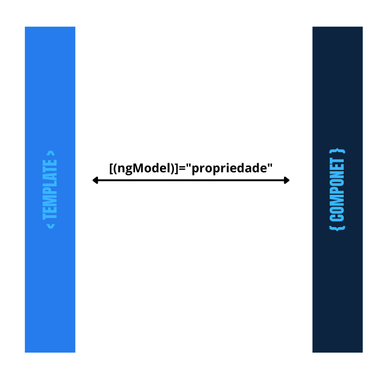

# Angular 14 

## 01 - Conhecendo o Angular

### Instalar e utilizar o Angular CLI

Para instalar o Angular CLI, abra seu terminal e utilize o seguinte comando:

`npm install -g @angular/cli@14.0.0`

### Criar uma aplicação Angular

Após instalarmos a ferramenta vamos usá-la para criar o projeto [memoteca, clique aqui e acesse o figma do projeto](https://www.figma.com/file/YTSUBbe7Zgwx3L567TAzTc/Memoteca---Angular%3A-Come%C3%A7ando-com-o-Framework?node-id=148%3A26), em seguida vá até o diretório que deseja construir sua aplicação e execute o comando a seguir:

`ng new memoteca`


[GitHub - Memoteca](https://github.com/alura-cursos/2438-angular-memoteca)

### Generate Component

Abra o terminal, e digite o comando ng `generate` e o caminho `componentes` juntamente com o nome do componente, que será "cabecalho":

`ng generate component componentes/cabecalho`

Será gerado os seguintes artefatos:

- cabecalho.component.css
- cabecalho.component.html
- cabecalho.component.spec.ts
- cabecalho.component.ts

Obs.: Você pode digitar a versão curta do comando: `ng g c componentes/cabecalho`

## 02 - Entendendo o fluxo de dados

### Property Binding
Passa valores de uma propriedade do component `pensamento.ts` para atributos de tag dentro do template `pensamento.html` com o uso de property binding;

` <input type="text" id="autoria" [value]="pensamento.autoria">`


Mostra valores de propriedades do component no template por meio da interpolação

`<p class="conteudo">{{ pensamento.conteudo }}</p>`


###  Event Binding
Escuta eventos do template e fazer a chamada de métodos no component com o event binding;

`<button (click)="criarPensamento()" class="botao">Salvar</button>`


### Two-way Data Binding
Usar a diretiva `ngModel` que pertence ao `FormsModule` para a comunicação bidirecional entre component e template.

Para isso, acessaremos no arquivo `app.module.ts`. Na seção imports, digitaremos uma vírgula após o último item e importaremos o `FormsModule`. Após o comando, o Auto Import fará a importação automática.

`imports: [BrowserModule,AppRoutingModule,FormsModule]`

No template substituir o atributo `[value]` pela diretiva `[(ngModel)]`, envolvendo-a em parênteses e colchetes por fora.

```
<input type="textarea" 
    class="input" 
    id="pensamento" 
    name="pensamento" 
    placeholder="Digite o pensamento" 
  [(ngModel)]="pensamento.conteudo">
```


## 03 - Navegação com roteamento

### Utilizar o RouterModule;

O RouterModule é um módulo do Angular que fornece a funcionalidade de roteamento na aplicação. Ele é responsável por gerenciar a navegação entre as diferentes telas ou componentes da aplicação.

### Utilizar a diretiva `<router-outlet>`;
Com o `router-outlet`, informamos ao Angular que queremos que os componentes sejam carregados dinamicamente atravez de roteamento.
No arquivo app.componets.html
```
<app-cabecalho></app-cabecalho>
<main>
    <router-outlet></router-outlet>
</main>
<app-rodape></app-rodape>
```

### Criar e configurar rotas;

no arquivo 'app-routing.module.ts' modificaremos o trecho `const routes: Routes = [];`

adicionando as rotas dos componetes criados dessa forma:
```
const routes: Routes = [
    {
        path: 'criarPensamento',
        component: CriarPensamentoComponent
    },
    {
        path: 'listarPensamento',
        component: ListarPensamentoComponent
    }
    
];
```
Com essa configurção ao acessar http://localhost:4200/criarPensamento/ o elemento será carregado na página .


Devemos criar também um path para a página inicial, com uma string vazia, que realizará um redirecionamento para o nosso mural de pensamentos.
```
{
    path: '',
    redirectTo: 'listarPensamento'
    pathMatch: 'full'
}
```
Assim, toda vez que acessarem a url raiz: http://localhost:4200/ será redirecionado pra rota configurada em `redirectTo`

### Navegar por meio da propriedade routerLink.

```
    <button 
      routerLink="/criarPensamento" 
    >Adicionar pensamento</button>

```

## 04 - Diretivas
As diretivas no Angular são instruções especiais que você pode adicionar aos elementos do seu template HTML para alterar o comportamento desses elementos. Elas permitem que você adicione lógica e funcionalidade aos seus componentes de uma maneira declarativa.

### Tipos diferentes de diretivas
Existem três tipos principais de diretivas no Angular:

1. Diretivas de Atributo: Modificam o comportamento ou a aparência de um elemento, componente ou outra diretiva.
1. Diretivas Estruturais: Alteram a estrutura do DOM, adicionando, removendo ou manipulando elementos.
1. Diretivas de Componente: São uma forma especial de diretiva que também possui um template.


### Diretivas estruturais, incluindo e excluindo elementos com ngFor e ngIf

#### ngFor

Antes de utilizá-la, acessaremos o arquivo `listar-pensamento.component.ts`, dentro da seção `export` criaremos o atributo listaPensamentos e inicializá-lo com um arranjo vazio.

`listaPensamentos = [];`

Acessaremos `listar-pensamento.html` e isolaremos o seletor `app-pensamento` em mais uma camada de div que vamos criar.

Nesta nova div interna, utilizaremos o ngFor. Esta diretiva é do tipo estrutural, pois consegue modificar os elementos no HTML. A sua sintaxe é `*ngFor=""`.

Essa diretiva receberá a expressão `"let pensamento of listaPensamentos"`, onde let criará uma variável local e `listaPensamentos` o atributo que criamos na classe.
```
    <div class="mural">
        <div *ngFor="let pensamento of listaPensamentos">
            <app-pensamento [pensamento]="pensamento"></app-pensamento>
        </div>
    </div>
```

No arquivo `listar-pensamento.html`, a comunicação entre componentes ocorre da seguinte maneira: o `listar-pensamento` atua como componente "pai" enquanto o `app-pensamento` seria um componente "filho".

Para passarmos as informações do componente "pai" `listar-pensamento` para o componente "filho" pensamento, acessaremos o arquivo pensamento.component.ts na seção export e vamos inserir o decorador `@Input()` ao lado de pensamento. Ao dar "Enter", será feita a importação automática deste arquivo.

`@Input() pensamento = {` 

#### ngIf

O `*ngIf` é uma diretiva estrutural do Angular que permite mostrar ou ocultar elementos do HTML com base em uma expressão booleana. Ela é muito útil para controlar a renderização de elementos com base em determinadas condições.

No exemplo aseguir, acessaremos o arquivo `listar-pensamento.component.html` e utilizaremos a diretiva `ngIf` diretamente na nossa div com a classe "mural", pois só queremos que essa div apareça se houverem pensamentos na propiedade `listaPensamentos` em `listar-pensamento.component.ts`.

```
<div class="mural" *ngIf="listaPensamentos.length > 0, else semPensamentos">
    <div *ngFor="let pensamento of listaPensamentos">
    <app-pensamento [pensamento]="pensamento"></app-pensamento>
    </div>
</div>
```

Caso a condição acima não ocorra `else` a diretiva renderiza o elemento `ng-template`com o nome `#semPensamentos.`
```
<ng-template #semPensamentos>
    <div class="ff-inter sem-pensamentos">
        <p>Ainda não há pensamentos cadastrados!</p>
  </div>
</ng-template>
```
Obs. o elemento `ng-template` não é renderizado por padrão, para isso é necessário que se indique, com o `else` nesse exemplo.


### Utilizar expressões para estilizar elementos com ngClass

No Angular isso é possível, através da configuração de estilos condicionais usando a diretiva `ngClass`. 

Para unificar os estilos dos cartões, acessaremos o componente `pensamento.component` que representa o cartão.

Se a gente abrir o arquivo CSS, veremos que existem duas configurações de largura:

```
.pensamento-g {
    width:556px;
}

.pensamento-p {
    width:262px;
}
```
Acessaremos o arquivo `pensamento.component.ts` e criaremos o método `larguraPensamento()` que retornará uma string. Dentro do método, criaremos uma condição para que os cartões sejam padronizados em dois tamanhos.
```
  larguraPensamento(): string {
    if(this.pensamento.conteudo.length >= 256) {
      return 'pensamento-g'
    }
    return 'pensamento-p'
  }
```
No arquivo `pensamento.component.html` na div de classe `pensamento`. Utilizaremos o `ngClass` em seu lugar, que receberá a expressão larguraPensamento criada no arquivo TS.
```
<div class="pensamento {{ pensamento.modelo }} ff-roboto-mono" [ngClass]="larguraPensamento()">
```
## 05 - 0Cumunicação com o Backend


### Utilizar o JSON-Server simulando uma API REST;

[Json-Server](backend/README.md)

### Criar uma interface para definir tipos personalizados;

A interface serve para definir a estrutura e o formato dos objetos que serão utilizados na aplicação Angular. Ela atua como um "contrato" entre o front-end e o back-end, garantindo que os dados sejam transmitidos e manipulados corretamente.

Criaremos uma interface diretamente no explorador à esquerda. Dentro da pasta pensamentos, damos um clique com o botão direito e criamos um novo arquivo chamado pensamento.ts. 

Dentro de `pensamento.ts`, criaremos uma interface de nome `Pensamento`, com inicial maiúscula. Nesta interface, colocaremos todos os atributos e os respectivos formatos esperados. Também incluiremos a classe export, para tornar essa interface acessível à outras classes.
```
export interface Pensamento {
    id: number
    conteudo: string
    autoria: string
    modelo: string
}
```

Como a interface que inserimos ajuda dentro da aplicação? Se tivéssemos incluído um atributo com o formato errado ou se esquecêssemos de informar algum atributo, o VS Code sinalizaria o erro.

Acessaremos três arquivos typescript e dentro deles vamos inserir a variável Pensamento, que deve receber a tipagem de Pensamento. Após o "Enter", a aplicação fará o import automático dessa variável.

- A primeira inclusão será feita no arquivo `pensamento.component.ts`.
```
@Input() pensamento: Pensamento = {
    id: 0, // colocamos o valor 0 pois os dados reais do `id` virão do componente "pai".
    conteudo: 'I love Angular',
    autoria: 'Nay',
    modelo: 'modelo3'
}
```
- A segunda inclusão será feita no arquivo `criar-pensamento.component.ts`.
```
pensamento: Pensamento = {
    id: 1,
    conteudo: 'Aprendendo Angular'
    autoria: 'Dev',
    modelo: 'modelo1'
}
```
- A terceira inclusão será feita no arquivo `listar-pensamento.component.ts`.
`    listaPensamentos: Pensamento[] = [];
`


#### Entender a importância do Service e o novo decorator @Injectable();

O Service no Angular é uma classe TypeScript que contém a lógica de negócios e a comunicação com o servidor. Algumas características importantes sobre os Services:

- São criados através do comando `ng g s` no terminal do VS Code.
São marcados com o decorador @Injectable, que permite a injeção de dependências.
- Possuem o metadado `providedIn` com o valor `root`, indicando que podem ser utilizados em toda a aplicação.
- Têm um construtor onde podem ser injetadas outras dependências.
Podem conter métodos de `CRUD (Create, Read, Update, Delete)` para interagir com o backend.
- A injeção de dependências é um conceito importante no Angular, pois permite que os Services sejam facilmente reutilizados em diferentes componentes da aplicação. Isso ajuda a manter o código organizado e facilita a manutenção.

```
import { Injectable } from '@angular/core';

@Injectable({
    providedIn: 'root'
})
export class PensamentoService {

    constructor() { }
}
```

### Injetar dependências.

A injeção de dependências é um conceito importante no Angular, pois permite que os Services sejam facilmente reutilizados em diferentes componentes da aplicação. Isso ajuda a manter o código organizado e facilita a manutenção.

No arquivo `pensamento.service.ts`, vamos adicionar o `HttpClient` para implementar os métodos do "CRUD". A classe PensamentoService depende dessa funcionalidade.

`import { HttpClient } from '@angular/common/http';`

Queremos que a instância de `HttpClient` seja injetada automaticamente no PensamentoService sem precisar ser instanciada manualmente. Para isso, no construtor da classe `PensamentoService`, incluiremos um parâmetro chamado http com o modificador de acesso private e o tipo de dependência `HttpClient`. O modificador private permite que esse parâmetro seja automaticamente declarado como um atributo da classe.
```
export class PensamentoService {
    constructor(http: HttpClient) { }
}
```


